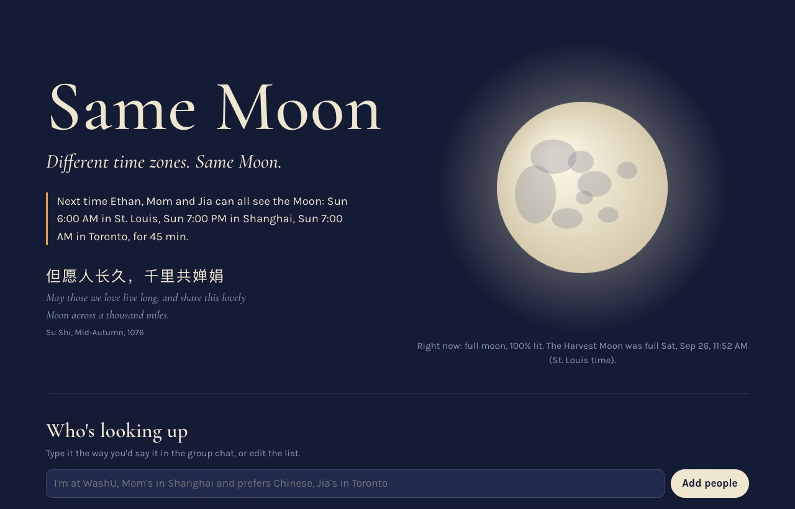
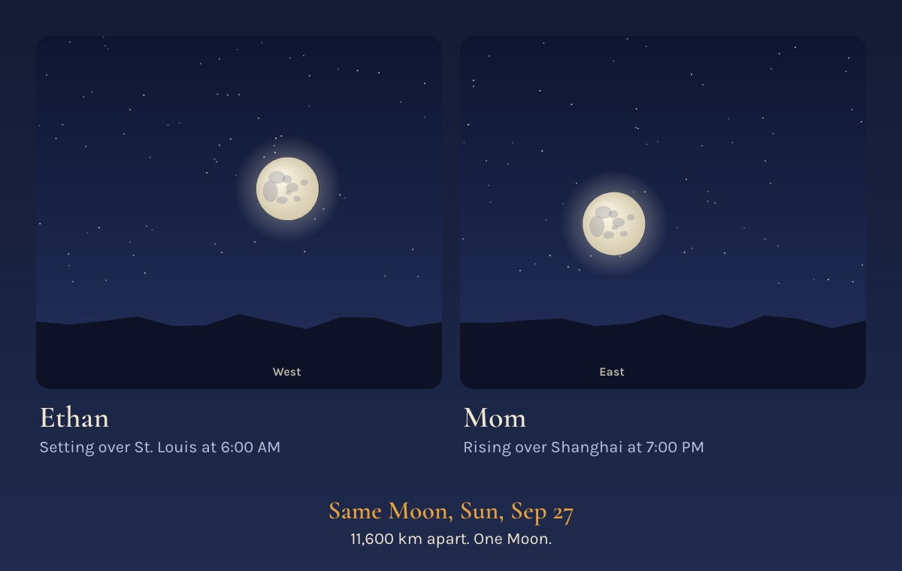
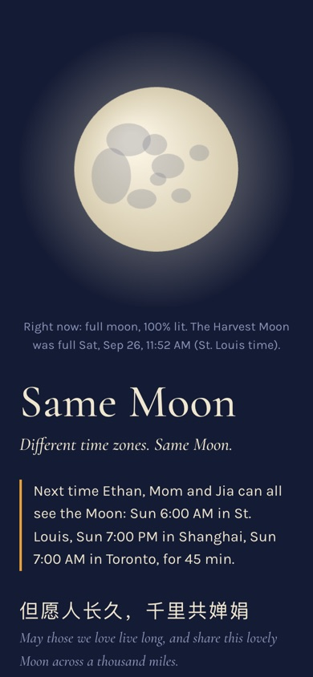
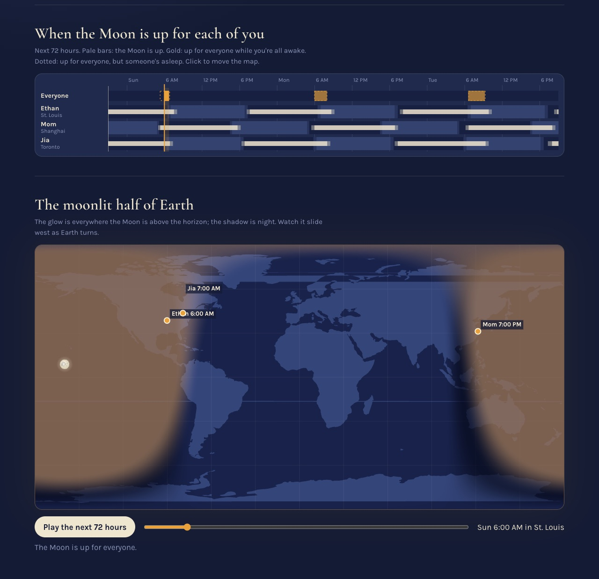

# Same Moon 🌕

**Different time zones. Same Moon.**

**Live demo: https://bomardchavit.github.io/washuhack26/**

Same Moon is an AI agent that lives in your family's iMessage group. It finds the moments when everyone, however far apart, can see the same Moon at the same time. At that moment it tells each person exactly where to look, in their own language, then turns everyone's photos into one shared memory.

Built for the HackWashU Fall AI Build Challenge (September 25–27, 2026), prompt: *Fly Me to the Moon*.

## Why

For a thousand years, people separated at Mid-Autumn have comforted themselves with one thought: at least we are looking at the same moon. Su Shi's Mid-Autumn poem (1076) ends on it: 但愿人长久，千里共婵娟.

Physics says that's only sometimes true. Everyone on Earth sees the same phase at the same moment, but whether the Moon is above *your* horizon depends on where you stand. This weekend, a student in St. Louis and a parent in Shanghai can both see the Harvest Moon for about two hours: from 5:20 to 7:25 AM Sunday in St. Louis, when it's setting there while it rises over dinner in Shanghai.

International students feel this most. In interviews with 200 international students, two-thirds reported loneliness or isolation, especially in their first months, including "cultural loneliness" from losing their familiar culture and language (Sawir et al., 2008). Research on shared attention finds that experiences shared *at the same time* feel more intense, but only when the other person feels close (Boothby, Clark & Bargh, 2014; Boothby et al., 2016). So Same Moon's job isn't just the calculation. It's making the other person feel present.

## What it does

1. Someone adds Same Moon to the family group chat and types how they'd naturally say it: *"I'm at WashU, Mom's in Shanghai and prefers Chinese, Jia's in Toronto."* iMessage doesn't share names with bots, so it asks what to call the person who wrote that.
2. It finds the next times the Moon is up for everyone during waking hours (skipping cloudy ones when online) and posts the options. People reply 1–3; the agent also sends the options as a native poll where the platform supports polls.
3. At the chosen moment it posts one message with a line for each person in their language: which direction to face, how high to look ("about one fist above the horizon"), and whether the Moon is rising or setting for them.
4. As photos arrive it shares them live: *"📷 Mom's Moon, rising over Shanghai at 7:02 PM. Ethan, that's the same Moon setting in your west right now."*
5. When two photos are in, it sends a postcard image, with both photos side by side, names, cities, local times and "11,600 km apart. One Moon.", followed by the same words as text.
6. Then it goes quiet until the next shared Moon.

## Try it

| What | Command |
| --- | --- |
| Web demo | https://bomardchavit.github.io/washuhack26/ (or `npm run web`, then open http://localhost:5173/web/) |
| Scripted group-chat story, no install, no accounts | `npm run demo` |
| Interactive chat simulator: type as anyone; `photo @mom ~/moon.heic` sends a real photo, and the postcard is saved to `agent/data/postcard.jpg` | `npm install`, then `npm run sim` |
| The real agent in Photon's terminal chat, no accounts | `npm install`, then `SAME_MOON_TERMINAL=1 npm run agent` |
| The real agent in iMessage through Photon | `cp .env.example .env`, add your Photon project ID and secret, then `npm run agent` |
| Tests | `npm test` (24 tests; the 8 that need dependencies skip until `npm install`) |

To rehearse a moment, `SAME_MOON_CLOCK=2026-09-27T10:59:00Z SAME_MOON_TERMINAL=1 npm run agent` starts the agent's clock at that time. Every moment it sends during a rehearsal is labeled `[Simulation]`.

## What's tested, and what isn't yet

Tested:

- **The astronomy.** Moonrise and moonset match six published St. Louis times for September 2026 to within a minute. The full-moon time is within 3 minutes and the transit altitude within 0.2° (`test/engine.test.js`).
- **The whole group-chat flow through Photon's real `spectrum-ts` terminal provider.** Two family members send photos and get back the postcard image. `test/photon.test.mjs` scripts it with a stand-in for Photon's terminal chat, and we also ran it by hand in the interactive terminal chat.
- **The postcard image.** It's composed from JPEG and iPhone HEIC photos. A photo that can't be read becomes that person's sky (`test/postcard.test.mjs`).
- **The Claude layer, against a mocked API.** This covers request shape, errors, selected numeric consistency checks and fallback behavior (`test/llm.test.mjs`).
- **The web demo in headless Chrome** at desktop and phone widths: no console errors, no horizontal scrolling.

Not tested yet:

- Real iMessage delivery through Photon. That needs project keys, and it covers native polls and sending the postcard image as an iMessage attachment.
- Live calls to the Claude API.
- A real Harvest Moon run with family abroad.

## How it works

**Physics does the facts; AI does the talking.**

- `engine/astro.js`: Sun and Moon positions from orbital elements with the main lunar perturbation terms, topocentric parallax, and refraction. No dependencies; runs in the browser and in Node.
- `engine/windows.js`: samples every person's sky every 5 minutes and finds the stretches when the Moon is at least 5° up for everyone during waking hours. "Night owls" are exempt from the waking-hours rule.
- `engine/messages.js`: direction, height and rising/setting in 7 languages (English, 中文, Español, 한국어, Tiếng Việt, 日本語, Français). Every number comes from the engine.
- `engine/parse.js`: understands "Mom's in 上海" and "I'm at WashU" without a model. Includes 98 cities, native-script names, and aliases.
- `agent/brain.mjs`: the conversation. It's platform-agnostic: chat events go in, and actions (send, react, poll, postcard) come out.
- `agent/llm.mjs` (optional): Claude Haiku 4.5, through the Anthropic SDK, handles messages the rules can't parse. It also answers free-form questions ("why can't Grandma see it now?") from facts the engine hands it. A basic numeric consistency check rejects some mismatched clock times, angles and percentages. It does not guarantee that a free-form answer is correct: it does not associate a number with a person or field, and some formats are not checked.
- `agent/photon.mjs`: delivers the brain over iMessage with Photon Spectrum (`spectrum-ts` 12). It sends group messages, reacts to photos, offers polls, sends the postcard as an attachment, and runs a scheduler that fires each moment on time, even after a restart.
- `web/draw.js` and `agent/postcard.mjs`: the postcard. The web demo and the agent share one drawing function; the agent renders it with `@napi-rs/canvas` and converts iPhone HEIC photos with macOS `sips`.
- `engine/online.js`: free Open-Meteo lookups for any town on Earth, plus hourly cloud cover. Everything still works offline.

## Privacy and restraint

- City names only: no GPS, no contacts, no message history.
- Phone numbers and emails are hashed before anything is stored. Photos are kept in memory only until the postcard is made; iPhone HEIC photos pass through a temporary file for conversion, which is deleted right away.
- It messages a few times a month, around shared Moons, and "stop" silences it.
- It uses the language the family tells it ("Mom prefers Chinese") instead of guessing from where someone lives.

## What we don't claim

We don't claim it cures loneliness. We're testing whether a shared, simultaneous moment feels different from a photo sent later. Visibility also depends on buildings, trees and weather that no model can see from a city name.

## Built with

Node.js, plain JavaScript and Canvas (no framework), Photon Spectrum (`spectrum-ts`) for iMessage, Claude Haiku 4.5 through the Anthropic SDK for language understanding, `@napi-rs/canvas` for the postcard image, Open-Meteo for geocoding and cloud forecasts, world-atlas / Natural Earth for the map outline, and Cormorant Garamond and Karla (SIL Open Font License).

**AI disclosure:** this project was built during the event with AI-assisted development (Claude), with Codex assisting final verification and submission preparation. See `docs/BUILDLOG.md`.

## Team

[Ardchavit Pattanapaisal](https://devpost.com/bomardchavit) — solo project.
